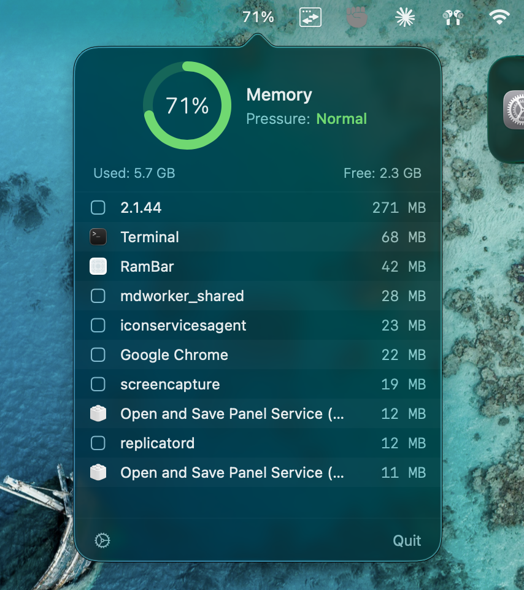

# RamBar

A lightweight macOS menu bar app that shows real-time RAM usage with per-app breakdown.

<p align="center">
  
</p>

<p align="center">
  
</p>

## Features

- Live RAM percentage in the menu bar
- Frosted-glass popover with memory pressure gauge
- Per-app RAM breakdown with app icons
- Helper process grouping (Chrome, Electron apps, etc.)
- Configurable refresh interval (1s / 3s / 5s)
- Launch at login support
- Native Swift + SwiftUI, zero dependencies

## Install

1. Download `RamBar-v1.0.0.zip` from [Releases](https://github.com/ImNyx4/rambar/releases/latest)
2. Unzip and move `RamBar.app` to Applications
3. Right-click > Open (first launch only, to bypass Gatekeeper)

## Build from Source

```bash
brew install xcodegen
git clone https://github.com/ImNyx4/rambar.git
cd rambar
xcodegen generate
xcodebuild -project RamBar.xcodeproj -scheme RamBar -configuration Release build
```

The built app will be in `DerivedData/Build/Products/Release/RamBar.app`.

## Requirements

- macOS 13.0 (Ventura) or later
- Apple Silicon or Intel Mac

## License

MIT
